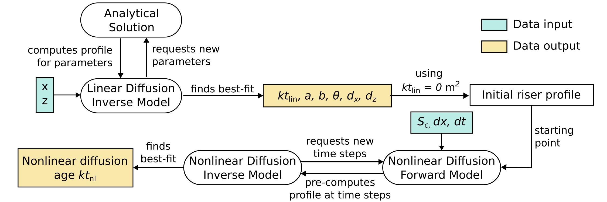

About 
=====

``riserfit`` is a Python package for performing morphological dating on fluvial terrace risers.
It supports riser profiles based on GNSS and DEM elevation data and can also be used for dating
of other scarp-like features.

The main workflow of ``riserfit`` consists of:

**1. Formatting elevation data into a suitable format.** This step usually consists of splitting 
``.csv`` files from GNSS measurement campaigns into separate files (one for each profile). 
Alternatively, this is the step in which elevation profiles are extracted from a DEM.

**2. Calculating linear diffusion ages and other parameters.** Optimal parameter combinations 
(within acceptable bounds) are efficiently identified using the analytical solution to riser/scarp 
evolution from the appendix of `Andrews and Hanks (1985) <https://doi.org/10.1029/JB090iB12p10193>`_.
This step results in best-fit parameters:

.. list-table:: Parameters generated by the linear diffusion inverse scheme
   :widths: 25 25 50
   :header-rows: 1

   * - Parameter
     - Unit
     - Description
   * - :math:`kt_\text{lin}`
     - m^2
     - | (Linear) diffusion age. It is the product
       | of time :math:`t` and diffusivity :math:`k`
   * - :math:`a`
     - m
     - Height from riser midpoint to crest/toe.
   * - :math:`b`
     - m/m
     - Far-field riser slope.
   * - :math:`\theta`
     - m/m
     - Initial slope of the riser face.
   * - :math:`d_x`
     - m
     - Offset in :math:`x` to center the riser midpoint at 0.
   * - :math:`d_y`
     - m
     - Offset in :math:`y` to center the riser midpoint at 0.

**3. Calculating nonlinear diffusion ages.** Using the geometrical parameters determined in 
step (2), a forward model is run starting at an initial shape determined by :math:`a, b, \theta`
to find the nonlinear diffusion age corresponding to a best fit. 

These first three processing steps are summarized in the flowchart below: The elevation profile is
used to optimize for riser height, far-field slope, initial slope, and linear diffusion age. These
results are then used as the basis of a forward model using the nonlinear diffusion equation. This 
latter model finds a best-fit nonlinear diffusion age.

**4. Calculating diffusivities and morphological ages.** The first three steps are based on previous 
work, although they are slightly more automized. Deriving diffusivities (:math:`k`) and ultimately 
morphological ages (:math:`t`) is a more complex endeavour. In the simplest case, we could divide 
:math:`kt` by some independent estimate of terrace age and arrive at an estimate for :math:`k`. 
We could then take this diffusivity and divide :math:`kt` of other terraces by it. This would 
result in a set of morphological age estimates, but disregards any form of error.

``riserfit`` provides a more robust way of inferring diffusivities and morphological ages: 
:math:`kt` estimates and uncertainties from multiple profiles spanning across the same riser 
are combined into a probability density estimate (essentially a KDE with variable bandwidth, see 
also `Vermeesch 2012 <https://doi.org/10.1016/j.chemgeo.2012.04.021>`_). A diffusivity estimate, also 
in the form of a probability density function, is inferred via a Monte Carlo random sampling
of the :math:`kt`-PDF. The diffusivity PDF can then be combined with :math:`kt` estimates from 
other terrace generations to generate morphological age estimates. This approach is somewhat 
experimental and altough median values seem to be accurate, uncertainties are *very* large.

